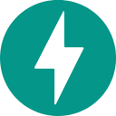

    

    <em>I design, engineer, and deploy AI agents that work like real employees, not just demo well.</em>

    
    
    
    

---

    🎓 Teaching Faculty at <a href="https://www.piaic.org/">PIAIC</a> · Trained 500+ developers in Agentic AI

    🛠️ Digital FTEs · Agentic Workflows · Custom MCP Servers · Automation Pipelines

    <code>Python</code> · <code>TypeScript</code>
     
    <code>OpenAI Agents SDK</code> · <code>LangChain</code> · <code>MCP</code> · <code>Claude Code</code> · <code>Gemini CLI</code>
     
    <code>FastAPI</code> · <code>Docker</code> · <code>OpenAI Chatkit</code> · <code>n8n</code>

    
    &nbsp;
    
    &nbsp;
    
    &nbsp;
    
    &nbsp;
    
    &nbsp;
    
    &nbsp;
    
    &nbsp;
    
    &nbsp;
    

---

<blockquote align="center">
  <em>
    “The night is long, but the dawn is bright. 
    The struggle is real, but the reward is great. 
    The journey is hard, but the destination is worth it. 
    Learning is the key, and the future is yours”
  </em>
</blockquote>

  <strong>
    May this quote inspire you, reminding you that every step toward your goal  
    is a step closer to a future of your own making.
  </strong>

  

